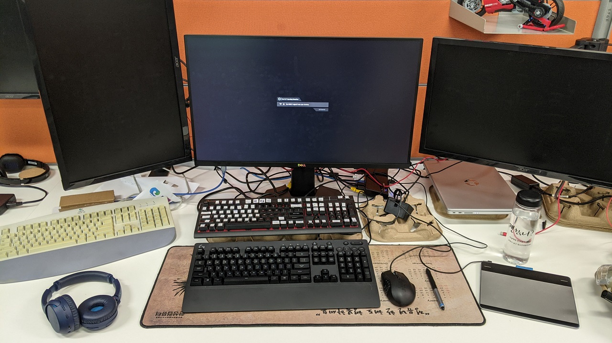

# PowerAppsMain

This AutoHotKey script is built to help development of Microsoft PowerApps (Canvas app).

## Overview

There functions uses hot key instead of mouse movement.

> The enchanced formula bar option has to be turned on to some of the functions to work.

## Requirements

I am using a full-size keyboard with function keys with number pad on right side.

Number row on the left are used for hot keys so when typing numbers, always used from the right number pad.

> Some of the functions (i.e. PAProperty) have hardcoded location for a mouse click. Change as requred.

Current Setup:
- Keyboard: Logitech G213
- Mouse: Razer Naga Epic Chroma
- Macropad: Android tablet with [Macro Deck](https://www.macrodeck.org/)
- Other input: Wacom CTH-480
- Monitor: 1920 * 1080 resolution. Windows scaling 100%

## Functions

### PAProperty

#### Description

It directly goes to a properties value within given property name

#### Syntax

**PAProperty**(*PropertyName*)

* *PropertyName* - Required.  Property to access.

#### Examples

**PAProperty("Fill")**

### ExpendFormulaMenu

#### Description

It opens PowerApps formula bar.

#### Syntax

**ExpendFormulaMenu()**

#### Examples

**ExpendFormulaMenu()**

## Razer Mouse setup
Naga Epic Chroma

