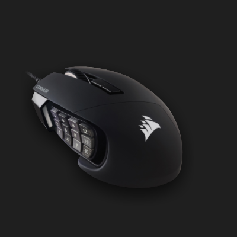
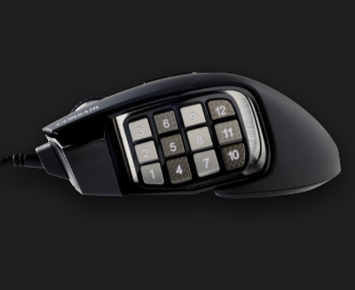

# Mouse
Corsair SCIMITAR RGB ELITE

## Overview

MMO mouse and it has extra 12 buttons on left hand side of the mouse.

Store some key stroke or shortcut on mouse memory and use. Can be used in conjunction with AHK. Because it is stored in onboard memory, Corsair software is not necessary to run (no need to install or running)

### Assignment
Save on "Hardware Key Assignements" and it will affect when you close iCUE software.

### Layout (* means assigned)

| Column 1 | Column 2 | Column 3 |
|----------|----------|----------|
| 1* | 2* | 3* |
| 4* | 5* | 6* |
| 7* | 8 | 9* |
| 10* | 11* | 12* |

### Mapping

- 1: Copy
- 2: NumpadSub
- 3: Backspace
- 4: Paste
- 5: Refresh Page
- 6: Previous Tab
- 7: Edge Tab Group
- 8: Blank AHK
- 9: Next Tab
- 10: PrintScreen
- 11: Tab
- 12: Enter

- DPI Button: Back Button

7 and 8 is using AHK.
Send F14 + 7 and F14 + 8